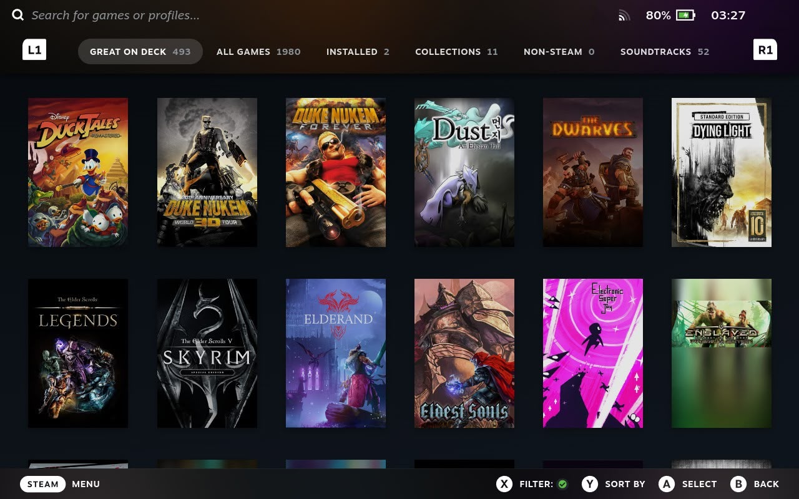
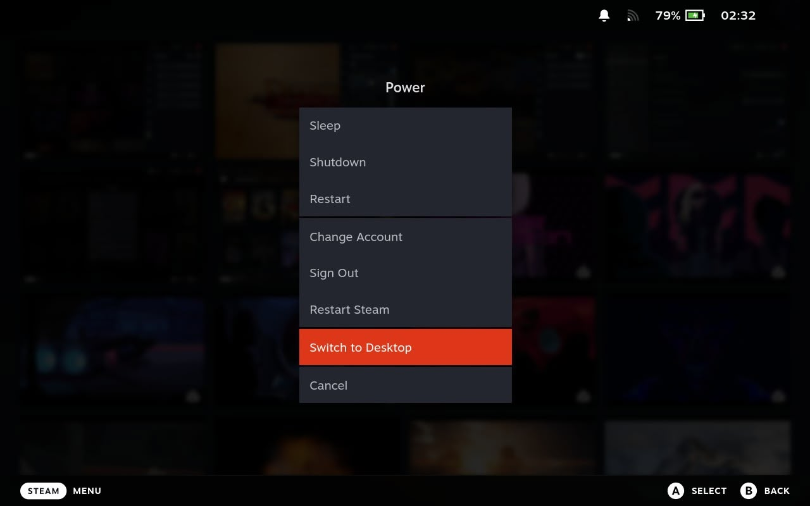
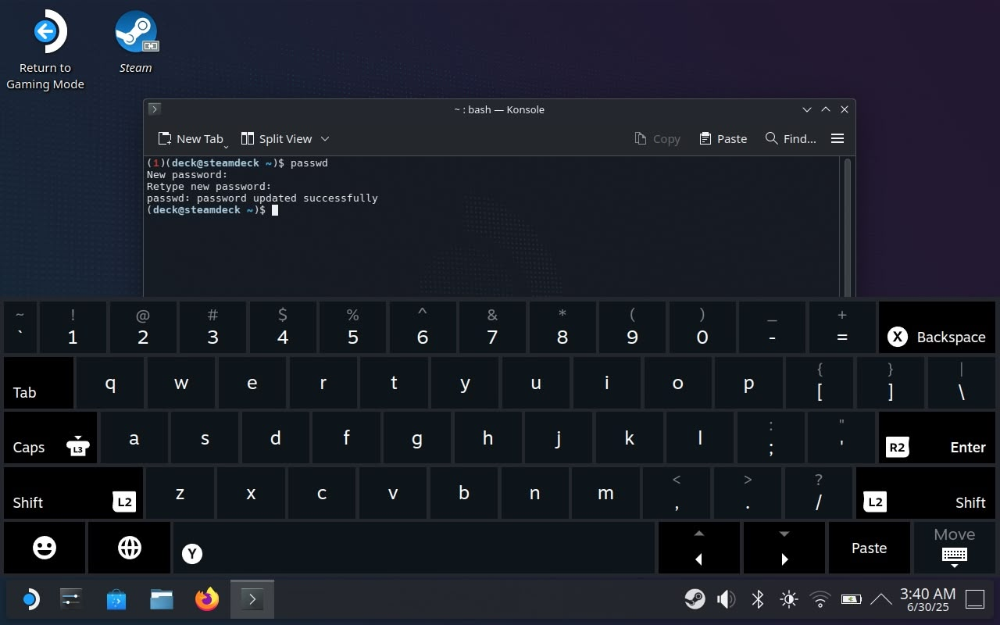
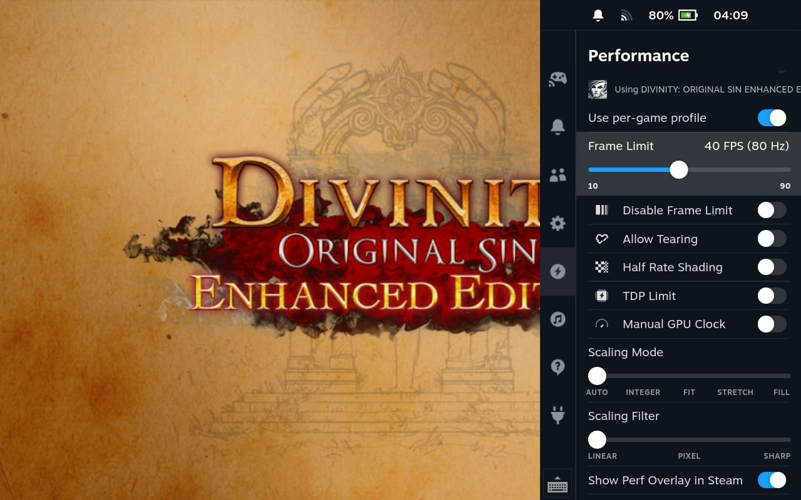

# Steam Deck Optimization Guide

This guide contains descriptions of settings and utilities for safely improving the performance, and useful information for advanced Steam Deck users. All settings supported **LCD** and **OLED** versions.

---

- [Basic](#basic)
  - [Gaming Mode](#gaming-mode)
  - [Desktop Mode](#desktop-mode)
  - [Switch Modes](#switch-modes)
  - [Shortcuts](#shortcuts)
- [Pre-Settings](#pre-settings)
  - [Developer Mode](#developer-mode)
  - [Beta Channel](#beta-channel)
  - [Root Password](#root-password)
  - [Enable SSH](#enable-ssh)
- [Homebrew](#homebrew)
  - [Decky](#decky)
- [Tweaks](#tweaks)
  - [SDWEAK](#sdweak)
  - [VRAM](#vram)
  - [BTRFS](#btrfs)
  - [40 FPS](#40-fps)
  - [ProtonUp-Qt](#protonup-qt)
- [Enhanced](#enhanced)
  - [Locale](#locale)
  - [Protontricks](#protontricks)
  - [Cabextract](#cabextract)
- [In-Game Settings](#in-game-settings)
- [References](#references)

---

## Basic

### Gaming Mode

This is an optimized mode for launching your games, similar to Big Picture on PC.

 

---

### Desktop Mode

In this mode, SteamOS is installed (based on the [Arch Linux](https://archlinux.org/) distribution with [KDE Plasma](https://kde.org/plasma-desktop/) as the desktop environment), and you have the full PC experience — connect keyboard/mouse/devices, install any apps, use a console, and many more...


---

### Switch Modes

By default, your Steam Deck loads on `Gaming Mode`.

To switch to `Desktop Mode`, follow these steps:
1. Press the <kbd>Steam</kbd> button and select `Power`
2. Scroll and click `Switch to Desktop`
3. Restart your Steam Deck when prompted



To return to `Gaming Mode`: 
- Restart your Steam Deck
- Double-click the `Return to Gaming Mode` icon on Desktop

---

### Shortcuts

To show the keyboard on `Desktop Mode` and `Gaming Mode`, use the <kbd>Steam</kbd> + <kbd>X</kbd> button combination.

> [!TIP]
> Hold the <kbd>Steam</kbd> button on `Gaming Mode` to see a list of all available shortcuts.

---

## Pre-Settings

### Developer Mode

To access certain advanced settings, you need to enable `Developer Mode`:
1. Switch your Steam Deck to `Gaming Mode`
2. Press <kbd>Steam</kbd> button and select `Settings`
3. Scroll up and click `System`
4. Enable `Enable Developer Mode`


---

### Beta Channel

Now, one thing you are going to want to do is move to the beta channel. The reason is that Valve is constantly pushing out updates and new features, and being in the beta channel ensures you get all the latest updates as they're released.

To enable the `Beta Channel`, follow these steps:
1. Switch your Steam Deck to `Gaming Mode`
2. Press <kbd>Steam</kbd> button and select `Settings`
3. Scroll up and click `System`
4. Change `System Update Channel` to `Beta`
5. Apply the update when needed
6. Restart your Steam Deck when prompted


---

### Root Password

By default, the Steam Deck user is shipped with no password. This is a secure setting that prevents access via SSH and can't be used to run commands via `sudo` for installing homebrew apps.

To set the password, follow these steps:
1. Switch your Steam Deck to `Desktop Mode`
2. Open the application menu and select `System`
3. Run the `Konsole` app

Type this command and hit <kbd>Enter</kbd>:
```shell
passwd
```

Type your new password and hit <kbd>Enter</kbd>. After retyping the password, hit <kbd>Enter</kbd> again.

> [!TIP]
> Typed characters do not appear on the screen!



---

### Enable SSH

SSH allows you to remotely interact with your Steam Deck, so you can transfer games from another Windows/MacOS/Linux computer directly to your Steam Deck. You can also do helpful things like install mods, manage game configs, keep tabs on running processes, and other fun maintenance things.

To enable SSH, follow these steps:
1. Switch your Steam Deck to `Desktop Mode`
2. Open the application menu and select `System`
3. Run the `Konsole` app

This would make the SSH server start at boot:

```shell
sudo systemctl enable sshd
```

After that, run this command to start the server immediately:

```shell
sudo systemctl start sshd
```


Now, on your computer, you should be able to access your Steam Deck terminal with this command and type password:

```shell
ssh deck@steamdeck.local
```

> [!TIP]
> If your router is not catching up with the domain name, you must type the Steam Deck's IP address manually instead of the `steamdeck.local`.
> 
> You can easily check the IP address by typing `ip addr` on the `Konsole` app.

---

## Homebrew

### Decky

> Decky Loader is a homebrew plugin launcher for the Steam Deck. It can be used to stylize your menus, change system sounds, adjust your screen saturation, change additional system settings, and more.

[](https://github.com/SteamDeckHomebrew/decky-loader)

To install `Decky`:
1. Switch your Steam Deck to `Desktop Mode`
2. Open `Firefox` and go to [https://decky.xyz](https://decky.xyz)
3. Download the `.desktop` file into your Download folder
4. Double-click the `Decky Installer` file
5. Enter your password when prompted

Alternatively, you can install `Decky` via console:

```shell
curl -L https://github.com/SteamDeckHomebrew/decky-installer/releases/latest/download/install_prerelease.sh | sh
```

...and go to `Decky`:
1. Switch your Steam Deck to `Gaming Mode`
2. Press the <kbd>...</kbd> button
3. Select `Decky`
4. Install plugins <sup>[preview](https://plugins.deckbrew.xyz)</sup>


Recommended plugins:
- `AutoSuspend` – automatically suspend on low power
- `HLTB for Deck` – show game lengths according to [HowLongToBeat](https://howlongtobeat.com)
- `ProtonDB Badges` – show tappable [ProtonDB](https://www.protondb.com) badges on your game pages
- `SteamGridDB` – customize your library with user-submitted images
- `MagicPods` – monitor the battery level of your *AirPods*, *Beats* and *Galaxy Buds* and switch between noise cancellation modes
- `WiFi Locker` – lock WiFi to a specific access point to prevent background scanning

---

## Tweaks

These are basic settings for additional optimization.

### SDWEAK

> Increases minimum, maximum, and average FPS. Improves smoothness, responsiveness, and frame timing. Reduces stutters and micro-freezes. Enhances system performance under heavy RAM load. Significantly improves process scheduling. Overall, optimizes system performance for a better gaming experience.

[](https://github.com/Taskerer/SDWEAK)

To install `SDWEAK`:
1. Switch your Steam Deck to `Desktop Mode`
2. Open the application menu and select `System`
3. Run the `Konsole` app

```shell
sudo steamos-readonly disable
```

Enter your password when prompted. And run script via console:

```shell
rm -f SDWEAK.zip && wget https://github.com/Taskerer/SDWEAK/releases/latest/download/SDWEAK.zip && rm -rf SDWEAK && unzip SDWEAK.zip && cd SDWEAK && sudo --preserve-env=HOME ./install.sh
```


> [!WARNING]
> After updating SteamOS, you must reinstall SDWEAK. 

---

### VRAM

By default, the Steam Deck uses 1GB of VRAM. This means the CPU will use the remaining 15GB of RAM. The GPU can use more than the 1GB reserved, but priority will always be given to the CPU.

<details>
  <summary>Compare results:</summary>

   
</details>

To change the VRAM size needed to run UEFI (aka BIOS):
1. Turn off your Steam Deck
2. Hold the <kbd>Volume Up (+)</kbd> button and turn on Steam Deck
3. Wait for UEFI to load
4. Click `Setup Utility` icon
5. Click `Advanced` tab
6. Scroll down and select `UMA Frame buffer Size`
7. Set it to `4GB`
8. Click `Save and Exit`


> [!WARNING]
> Games not compatible with this setting:
> - **Red Dead Redemption 2**

> [!IMPORTANT]
> This setting reset to default after the UEFI update.

----

### BTRFS

> Btrfs with its transparent compression and deduplication capabilities can achieve impressive storage gains but also improve loading times because of less data being read. It also supports instant snapshotting which is very useful to roll back to a previous state.

[](https://gitlab.com/popsulfr/steamos-btrfs)

<details>
  <summary>Compare results:</summary>

  
</details>

> [!CAUTION]
> Before installation **read all information on the repo** about this tweak and potential problems like a free space available, and can't go back to ext4 after the conversion process, flatpak issues...

To install `SteamOS-Btrfs`:
1. Switch your Steam Deck to `Desktop Mode`
2. Open `Firefox` and go to [https://gitlab.com/popsulfr/steamos-btrfs#desktop-installer](https://gitlab.com/popsulfr/steamos-btrfs#desktop-installer)
3. Download the `.desktop` file into your Desktop
4. Double-click this icon on Desktop
5. Enter your password when prompted
6. When your Steam Deck reboots wait the conversion process will end (it's not frozen! **don't reboot!**)

Alternatively, you can install `SteamOS-Btrfs` via console:

```shell
t="$(mktemp -d)"
curl -sSL https://gitlab.com/popsulfr/steamos-btrfs/-/archive/main/steamos-btrfs-main.tar.gz | tar -xzf - -C "$t" --strip-components=1
"$t/install.sh"
rm -rf "$t"
```

---

### 40 FPS

Although 60 FPS provides the best gaming experience, it's not always feasible due to the game's inability to sustain it or the draining of battery life. In such cases, a lower option like 30 FPS is preferred. While 40 FPS may appear closer to 30 FPS, it's not the case.

- **60 FPS** – game refreshes every **16.7 ms**
- **40 FPS** – game refreshes every **25 ms**
- **30 FPS** – game refreshes every **33.3 ms**

By doing the math, one can see that 40 FPS is precisely in the middle between 30 and 60 FPS. The quicker a game updates, the more improvement there is in input lag, leading to a smoother visual experience. <sup>[Digital Foundry Test](https://www.youtube.com/watch?v=GF8NzlBiaOM)<sup>

To set the `Framerate Limit`:
1. Switch your Steam Deck to `Gaming Mode`
2. Press the <kbd>...</kbd> button
3. Select `Perfomance`
4. Scroll down and set the `Framerate Limit` to `40`



---

### ProtonUp-Qt

> ProtonUp-Qt is a simple and great way to manage the likes of GE-Proton (previously known as Proton GE), the Luxtorpeda compatibility tool for Native Linux game engines and more.

[](https://github.com/DavidoTek/ProtonUp-Qt)

Install `ProtonUp-Qt`:
1. Switch Steam Deck on `Desktop Mode`
2. Open application menu and select `Utilities`
3. Run `Discover` app
4. Type on searchbox `proton`
5. Select `ProtonUp-Qt` and click `Install`

Alternatively, you can install `ProtonUp-Qt` via console:

```shell
sudo flatpak install flathub net.davidotek.pupgui2 -y
```

For install the latest Proton version:

1. Open application menu and select `Utilities`
2. Run `ProtonUp-Qt` app
3. Click `Add version`, select the latest version, and click `Install`


Now, if you need to change the Proton version for a game, you can do so in three ways.

Via the `ProtonUp-Qt` app:


> [!WARNING]
> Close the Steam app before changes!

...or change via the `Steam` app: 


...or change on `Gaming Mode`: 


---

## Enhanced

### Locale

Some third party apps or games must be launched with the specific locale and not language running on your system.

For example, japanese apps must be launched with `JA-JP` locale:
1. Switch your Steam Deck to `Gaming Mode` or `Desktop Mode`
2. Select your app or game
3. Go to `Settings`
4. Change `Launch Options` to `LANG=ja_JP.UTF-8 %command%` 

---

### Protontricks

> This is a wrapper script that allows you to easily run Winetricks commands for Steam Play/Proton games among other common Wine features, such as launching external Windows executables. This is often useful when a game requires closed-source runtime libraries or applications that are not included with Proton.

[](https://github.com/Matoking/protontricks)

Install `Protontricks`:
1. Switch Steam Deck on `Desktop Mode`
2. Open application menu and select `Utilities`
3. Run `Discover` app
4. Type on searchbox `proton`
5. Select `Protontricks` and click `Install`

Alternatively, you can install `Protontricks` via console:

```shell
sudo flatpak install flathub com.github.Matoking.protontricks -y
```

Sometimes it is necessary to install or update software in a container with a specific game.

For example, update the old `Uplay Launcher` to the new `Ubisoft Connect` for the correct launch of the game:
1. Open application menu and select `Utilities`
2. Run `Protontricks` app
3. Select your game and click `OK`
4. Select `Install an application` and click `OK`
5. Scroll down, select `Uplay` and click `OK`
6. `Next > Next > Finish` and wait when application install


---

### Cabextract

> Cabextract is Free Software for extracting Microsoft cabinet files, also called .CAB files.

For install `cabextract` into your system:
1. Switch Steam Deck on `Desktop Mode`
2. Open the application menu and select `System`
3. Run the `Konsole` app

Type this command and hit <kbd>Enter</kbd>:

```shell
sudo steamos-readonly disable
```

Enter your password when prompted. Also needed to type all the below commands:

```shell
sudo pacman-key --init
sudo pacman-key -u
sudo pacman-key --populate
sudo pacman -S cabextract
```

After is completed type this command and hit <kbd>Enter</kbd> again:

```shell
sudo steamos-readonly enable
```

---

Alternatively, it is needed to install `cabextract` for a specific game. For example, this is needed to fix skipping all cutscenes and videos in `Darksiders: Warmastered Edition`.

1. Switch Steam Deck on `Desktop Mode`
2. Open `Firefox` and go to [https://gitlab.com/steevyp/mf-installcab_steamdeck](https://gitlab.com/steevyp/mf-installcab_steamdeck)
3. Download the `.zip` source code archive file into your Downloads directory
4. Extract the `.zip` file

Alternatively, you can download `.zip` and extract the file via console:

```shell
curl -s -L "https://gitlab.com/steevyp/mf-installcab_steamdeck/-/archive/main/mf-installcab_steamdeck-main.zip" -o "$HOME/Downloads/mf-installcab_steamdeck-main.zip"
unzip -o "$HOME/Downloads/mf-installcab_steamdeck-main.zip" -d "$HOME/Downloads"
```

1. Open the application menu and select `System`
2. Run the `Konsole` app

Type this command and hit <kbd>Enter</kbd>:

```shell
PROTON="$HOME/.steam/root/steamapps/common/Proton 8.0" && \
WINEPREFIX="$HOME/steam/root/steamapps/compatdata/462780/pfx" ./install-mf-64.sh -proton
```

And wait when application install.

1. Copy `mfplat.dll` to installed game directory
2. Switch your Steam Deck to `Gaming Mode`
3. Change the Proton version to `8.0` for a game

Alternatively, you can copy `mfplat.dll` file via console:

```shell
cp "$HOME/Downloads/mf-installcab_steamdeck-main/mfplat.dll" "$HOME/.steam/steam/steamapps/common/Darksiders Warmastered Edition/mfplat.dll"
```

> [!NOTE]
> `462780` is ID for `Darksiders: Warmastered Edition` game.

---

## In-Game Settings

### ● Anti-Aliasing

If possible, set it to FXAA or TAA. SSAA or MSAA are mostly not recommended because they consume a lot of power.

### ● Screen Space Reflections

Reduce all reflections to the lowest possible settings. They are usually expensive to process.

### ● Ambient Occlusion

This one is a bit tricky, as it is heavily dependent on the algorithm used. Try playing with the settings to see what works best for your game.

### ● Tessellation

Turn it off, as many game engines and developers misuse it, causing a lot of stress on the GPU. It won't be missed on an 800p screen.

### ● Shadows

Shadows can also be very resource-intensive, depending on how they are rendered. This is another setting you should try lowering first.

---

## References

Official:
- [Steam Deck Support](https://help.steampowered.com/en/wizard/HelpWithSteamDeck)
- [Steam Deck FAQ](https://www.steamdeck.com/en/faq)
- [Steamworks Steam Deck FAQ](https://partner.steamgames.com/doc/steamdeck/faq)

Community:
- [CryoByte33 FAQ](https://github.com/CryoByte33/steam-deck-utilities/blob/main/docs/faq.md)
- [r/SteamDeck](https://www.reddit.com/r/SteamDeck)
- [PCGamingWiki](https://www.pcgamingwiki.com/wiki/Steam_Deck)
- [Steam Deck Guide](https://github.com/mikeroyal/Steam-Deck-Guide)
- [protondb](https://www.protondb.com)

---

<sub>Steam Deck illustration created by [ApeWTF](https://ape.wtf/). All screenshots from opened internet resources. All rights reserved.</sub>
